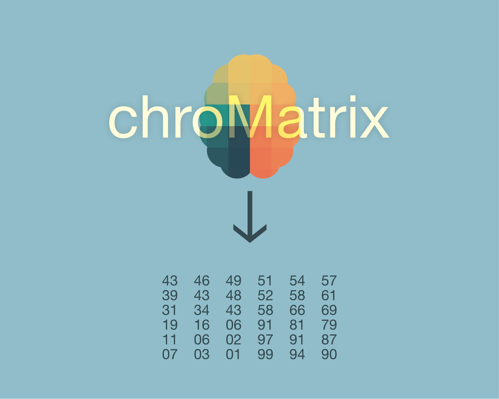

# chroMatrix - Image Color Analysis Tool


**chroMatrix** is an interactive web app for analyzing image colors, released under the GNU General Public License v3. It allows users to define a custom gradient, upload an image, select an area, sample colors within a grid, and visualize their position within the gradient, with the option to download the data in CSV format.

## Key Features

*   **Custom Gradient:** Create and modify color gradients by specifying colors and their positions.
*   **Color Interpolation:** Choose between linear and smooth interpolation for a smoother gradient.
*   **Image Upload:** Upload images from your device to analyze their colors.
*   **Area Selection:** Draw a rectangle on the image to select the area of interest.
*   **Sampling Grid:** Define the number of rows and columns to divide the selected area.
*   **Color Sampling:** Sample colors within the grid.
*   **Detailed Analysis:** Display the position of each color in the gradient, the associated numeric value, and the distance of the sampled color from the gradient.
*   **CSV Download:** Download the sampling data in CSV format for further analysis.
*   **Local Execution:** Does not require a server to run, just open the HTML file in a browser.
*   **No Dependencies:** No dependencies need to be installed, other than a web browser.

## How to Use

1.  **Clone the Repository:**
    ```bash
    git clone https://github.com/YOUR_USERNAME/chroMatrix.git
    ```
2.  **Open `index.html` in Your Browser:**
    Open the `index.html` file directly in your web browser.
3.  **Define the Gradient:** Use the controls to add and remove colors, and modify the interpolation type.
4.  **Upload an Image:** Use the "Choose an image" button to upload an image.
5.  **Select the Area:** Draw a rectangle on the image using your mouse. You can resize the rectangle by dragging the handles on the corners.
6.  **Define the Grid:** Specify the number of rows and columns for the sampling grid.
7.  **Sample Colors:** After drawing the rectangle, the colors will be automatically sampled and displayed.
8.  **Download Data:** Use the "Download CSV" button to save the sampling data.

## Important Note

*   **Browser Compatibility:** This application has been successfully tested on Google Chrome and Mozilla Firefox.
*   **Eyedropper in Opera:** Some browsers like Opera may have issues with the "eyedropper" functionality for correct sampling. It's recommended to use other browsers for an optimal experience.

## File Structure

*   `index.html`: HTML structure of the application.
*   `styles.css`: CSS stylesheets for the visual appearance of the application.
*   `script.js`: JavaScript logic for the application's functionality.

## Technologies Used

*   HTML5
*   CSS3
*   JavaScript
*   [chroma.js](https://cdnjs.com/libraries/chroma-js) (Library for color manipulation)

## How to Contribute

Contributions are welcome! If you want to improve **chroMatrix**, feel free to:

1.  Fork the repository.
2.  Create a branch with your feature or bug fix.
3.  Submit a pull request.

## License

This project is released under the GNU General Public License v3.

The GNU General Public License (GPL) is a free and copyleft license that grants users the following freedoms:

*   **Freedom to Run:** The freedom to run the program for any purpose.
*   **Freedom to Study:** The freedom to study how the program works and modify it to suit your needs.
*   **Freedom to Redistribute:** The freedom to distribute copies of the program.
*   **Freedom to Improve:** The freedom to distribute copies of modified versions of the program.

For more details, you can consult the full text of the license: [GNU General Public License v3](https://www.gnu.org/licenses/gpl-3.0).

## Disclaimer

This project is provided "as is", without any warranty of any kind. Any responsibility is disclaimed for direct or indirect damages resulting from the use of this software.


